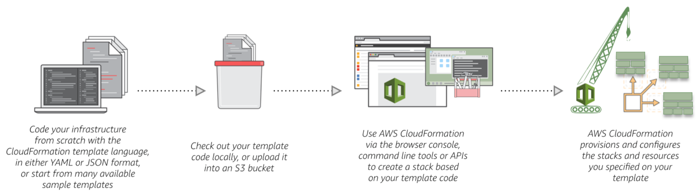

Amazon Web Services Setup
=========================

The Blacksmith project leverages Amazon Web Services (AWS) to host and manage the infrastructure that is created through the Cloud Formation (CFN) templates provided.
Also, it uses CloudFormation to describe and provision all the infrastructure resources in AWS.

AWS CloudFormation
##################

CloudFormation allows you to use a simple text file to model and provision, in an automated and secure manner, all the resources needed for your applications across all regions and accounts.
AWS CloudFormation is available at no additional charge, and you pay only for the AWS resources needed to run your applications.

AWS Free Tier Account
#####################

You can try some AWS services free of charge within certain usage limits.
When you create an AWS account, you're automatically signed up for the Free Tier for 12 months.
Your Free Tier eligibility expires at the end of the 12-month period.
When your Free Tier expires, AWS starts charging the regular rates for any AWS services and resources that you're using.

To avoid charges while on the Free Tier, you must keep your usage below the `Free Tier limits <https://docs.aws.amazon.com/awsaccountbilling/latest/aboutv2/free-tier-limits.html>`_.
You are charged for any usage that exceeds the limits. To help you stay within the limits, you can track your Free Tier usage and set a billing alarm to notify you if you start incurring charges.

* `Available AWS Free Tier Services <https://aws.amazon.com/free/?all-free-tier.sort-by=item.additionalFields.SortRank&all-free-tier.sort-order=asc>`_

When you sign up for Amazon Web Services (AWS), your AWS account is automatically signed up for all services in AWS.
Remember that you are charged **ONLY** for the services that you use.
Part of the sign-up procedure involves receiving a phone call and entering a verification code on the phone keypad.
Note your AWS account ID and information.

For the purpose of this project, remember that you will have to follow all those steps below **ONCE** in order to set up your local AWS environment.

AWS Account Creation
********************

To access and use any service offered by AWS, you must first create an AWS account at http://aws.amazon.com.

* Follow these instructions: https://portal.aws.amazon.com/billing/signup.

Add IAM User
************

It is not best practices to use your root AWS account for development.
Therefore, I highly recommend to add an IAM user to your account and use it whilte testing and using the templates provided by this project.

* Follow these instructions: https://docs.aws.amazon.com/en_pv/IAM/latest/UserGuide/id_users_create.html

AWS CLI
#######

The AWS Command Line Interface (CLI) is a unified tool to manage your AWS services.
With just one tool to download and configure, you can control multiple AWS services from the command line and automate them through scripts.

.. toctree::
   :maxdepth: 2

   Installation <aws_cli_setup>
   EC2 Key Pairs <aws_ec2_keys>

References
##########

* https://aws.amazon.com/cloudformation/