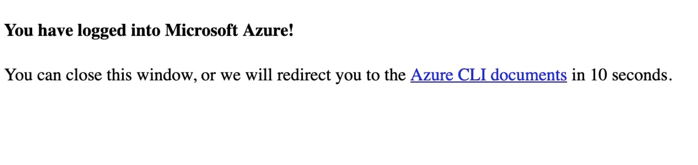

Azure CLI Installation
======================

The Azure command-line interface (CLI) is Microsoft's cross-platform command-line experience for managing Azure resources.
The Azure CLI is available to install in Windows, maxOS and Linux environments.
It can also be run in a Docker container and Azure Cloud Shell.

You can learn more about the installation steps for each platform here https://docs.microsoft.com/en-us/cli/azure/install-azure-cli?view=azure-cli-latest

Homebrew
########

.. code-block:: console

    $ brew update && brew install azure-cli

You can then run the Azure CLI with the az command

.. code-block:: console

    $ az

    Welcome to Azure CLI!
    ---------------------
    Use `az -h` to see available commands or go to https://aka.ms/cli.

    Telemetry
    ---------
    The Azure CLI collects usage data in order to improve your experience.
    The data is anonymous and does not include commandline argument values.
    The data is collected by Microsoft.

    You can change your telemetry settings with `az configure`.

        /\
        /  \    _____   _ _  ___ _
    / /\ \  |_  / | | | \'__/ _\
    / ____ \  / /| |_| | | |  __/
    /_/    \_\/___|\__,_|_|  \___|

    Welcome to the cool new Azure CLI!

    Use `az --version` to display the current version.
    Here are the base commands:

        account             : Manage Azure subscription information.
        acr                 : Manage private registries with Azure Container Registries.

Configure Azure Login
#####################

Once you install AZ CLI and have an azure account created, you can set up your login settings via the **az login** command.
You will be redirected to your default browser to log in with your Azure account.

.. code-block:: console

    $ az login

.. code-block:: console

    $ az login
    
    You have logged in. Now let us find all the subscriptions to which you have access...
    [
    {
        "cloudName": "AzureCloud",
        "id": "xxx-xxx-xx-xx-xxxx",
    ...
    .....

Set Default Active Subscription
###############################

If you have more than one subscription mapped to your azure account, you can set a specific subscription to be the default current active subscription.

First, I recommend to always retrieve up-to-date subscriptions from server

.. code-block:: console

    $ az account list --refresh

Then, set active subscription

.. code-block:: console

    $ az account set --subscription xxxxxxxx-xxxx-xxxx-xxxx-xxxxxxxxxxxx

References
**********

* https://docs.microsoft.com/en-us/cli/azure/install-azure-cli-macos?view=azure-cli-latest
* https://docs.microsoft.com/en-us/cli/azure/reference-index?view=azure-cli-latest#az-login
* https://docs.microsoft.com/en-us/cli/azure/account?view=azure-cli-latest