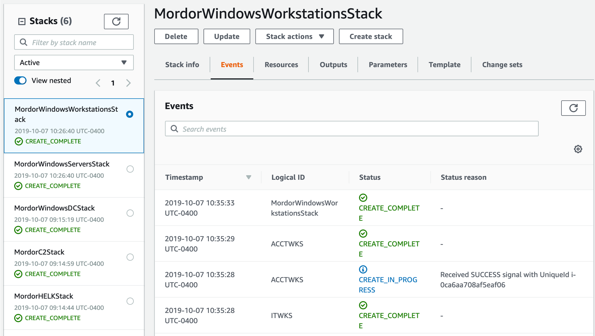
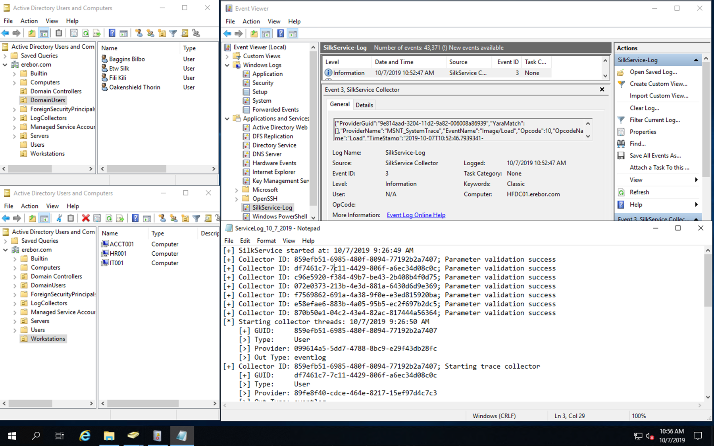
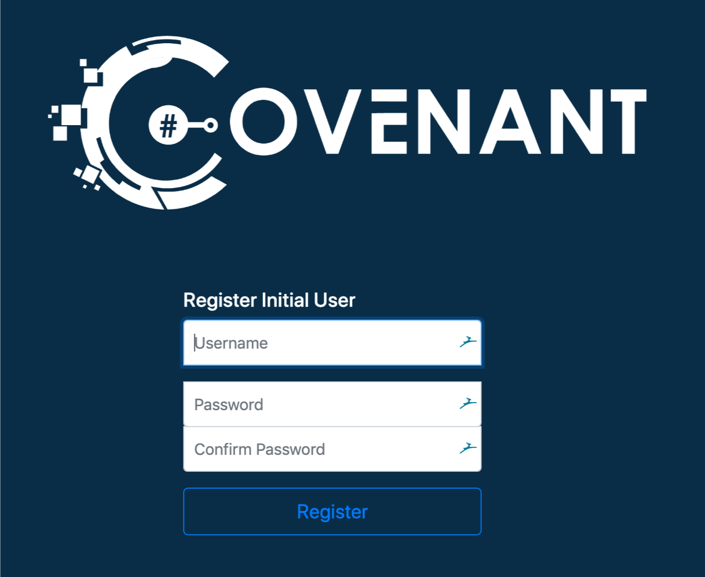

Erebor CloudFormation Deployment
================================

Pre-Deployment
##############

First, make sure you **git clone** the main repo:

.. code-block:: console

    $ git clone https://github.com/hunters-forge/Blacksmith
    $ cd Blacksmith/aws/mordor/

Update Parameters File
**********************

You can update the parameters applied to the whole environment in the following folder:

.. code-block:: console

    $ cd cfn-parameters/erebor

Most of them are already filled out for you to build the official standard environment that the mordor project uses.
However, you must upate the following parametes:

* Parameter File: **ec2-network-parameters**, Parameter value for key: **RestrictLocation** (this is the public IP address that you want to whitelist for external connections)
* Parameter File: **All other parameters files**, Parameter value for key: **KeyName** (Pair Key Name you created for your stacks. Check the AWS EC2 Key Pairs document in this wiki)

Automatic Deployment
####################

You will just have to run the script named **deploy-mordor.sh** with the arguments **-e 'shire'** as shown below in the Blacksmith/aws/mordor/ path

.. code-block:: console

    $ cd ../
    $ ./deploy-mordor.sh -e 'erebor'

Monitor Stack Build Logs
########################

AWS CLI View
************

The aws cloudformation list-stacks command returns summary information about any of your running or deleted stacks, including the name, stack identifier, template, and status.

.. code-block:: console

    $ aws --region us-east-1 cloudformation list-stacks --stack-status-filter CREATE_COMPLETE

The aws cloudformation describe-stacks command provides information on your running stacks.
You can use an option to filter results on a stack name.
This command returns information about the stack, including the name, stack identifier, and status. 

.. code-block:: console

    $ aws --region us-east-1 cloudformation describe-stack-events --stack-name MordorWindowsWorkstationsStack

AWS CloudFormation Console
**************************

You can use the AWS CloudFormation console to see all your stacks, their events, templates uploaded and more.

.. image:: _static/CFN-Services-CloudFormation.png
    :alt: Erebor
    :scale: 30%

All the templates that you sent over to AWS will start being processed immediately

.. image:: _static/CFN-Stacks-Erebor-Console.png
    :alt: Erebor
    :scale: 30%

You can click on each stack and get more information about the deployment

.. image:: _static/CFN-Stack-Erebor-Workstations-Events.png
    :alt: Erebor
    :scale: 30%

Once a stack is complete you will be able to see it sending a successful signal back to the management console

Once all your instances are up and running you will be able to see them via the CloudFormation and the EC2 instances dashboard

.. image:: _static/CFN-Erebor-EC2-Running.png
    :alt: Erebor
    :scale: 30%

Connect to Instances
####################

SSH (Linux)
***********

.. code-block:: console

    $ ssh -v -i <Private Key File>.pem ubuntu@<public-DNS-name>

RDP (Windows)
*************

Browser (HELK & Covenant C2)
****************************

.. image:: _static/CFN-Stack-Erebor-HELK-Kibana.png
    :alt: Erebor
    :scale: 30%

Delete Stacks
#############

.. code-block:: console

    $ aws --region us-east-1 cloudformation delete-stack --stack-name MordorWindowsWorkstationsStack
    $ aws --region us-east-1 cloudformation delete-stack --stack-name MordorWindowsServersStack
    $ aws --region us-east-1 cloudformation delete-stack --stack-name MordorC2Stack
    $ aws --region us-east-1 cloudformation delete-stack --stack-name MordorHELKStack
    $ aws --region us-east-1 cloudformation delete-stack --stack-name MordorWindowsDCStack (Wait until the other Windows stacks are destroyed)
    $ aws --region us-east-1 cloudformation delete-stack --stack-name MordorNetworkStack (Wait untill all the other stacks are destroyed)
