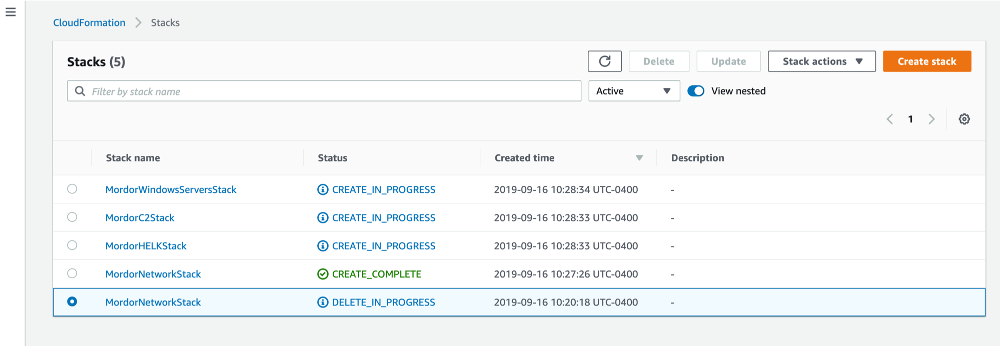
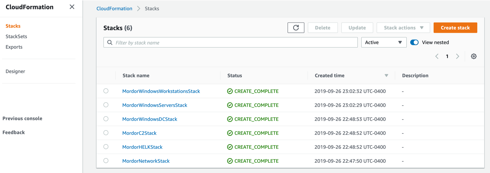
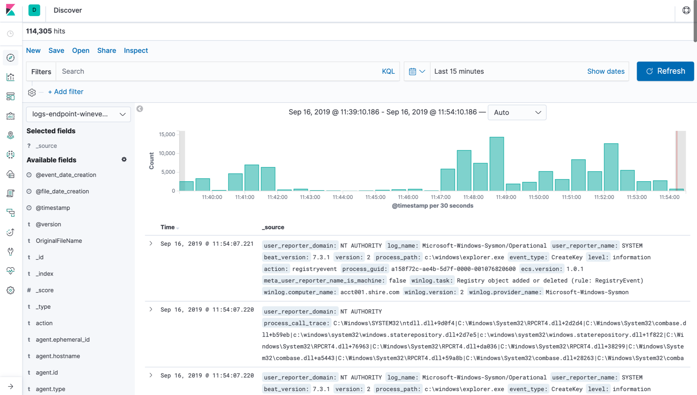

Shire CloudFormation Deployment
===============================

Templates
#########

+------------------------------------+-------------------------------------------------------------------------------------------------------------------------+
| Template                           | Format                                                                                                                  |
+====================================+=========================================================================================================================+
| Mordor-Shire-EC2-Network           | `JSON <https://github.com/Cyb3rWard0g/Blacksmith/blob/master/aws/mordor/shire/Mordor-Shire-EC2-Network.json>`_          |
+------------------------------------+-------------------------------------------------------------------------------------------------------------------------+
| Mordor-Shire-HELK-Server           | `JSON <https://github.com/Cyb3rWard0g/Blacksmith/blob/master/aws/mordor/shire/Mordor-Shire-HELK-Server.json>`_          |
+------------------------------------+-------------------------------------------------------------------------------------------------------------------------+
| Mordor-Shire-C2-Server             | `JSON <https://github.com/Cyb3rWard0g/Blacksmith/blob/master/aws/mordor/shire/Mordor-Shire-C2-Server.json>`_            |
+------------------------------------+-------------------------------------------------------------------------------------------------------------------------+
| Mordor-Shire-Windows-DC            | `JSON <https://github.com/Cyb3rWard0g/Blacksmith/blob/master/aws/mordor/shire/Mordor-Shire-Windows-DC.json>`_           |
+------------------------------------+-------------------------------------------------------------------------------------------------------------------------+
| Mordor-Shire-Windows-Workstations  | `JSON <https://github.com/Cyb3rWard0g/Blacksmith/blob/master/aws/mordor/shire/Mordor-Shire-Windows-Workstations.json>`_ |
+------------------------------------+-------------------------------------------------------------------------------------------------------------------------+

Pre-Requirements
################

* An existing AWS Account (Free tier is recommended)
* AWS CLI installed
* EC2 Key Pair Available
* 20 mins of your day

Pre-Deployment
##############

First, make sure you you **git clone** the main repo:

.. code-block:: console

    $ git clone https://github.com/Cyb3rWard0g/Blacksmith
    $ cd Blacksmith/aws/mordor/shire

Pay attention with every command.
There are only 2 things you will have to update with your own information:

* <Key Pair Name>
* <Restrict Location> (You can run **curl ifconfig.io** to get your public IP)

Manual Deployment
#################

You can deploy each template stack manually by running all the commands below:

EC2 Network Resources
*********************

* Estimated Time: ``2mins``
* Deployed in Parallel: ``False``

This template defines the virtual private cloud (VPC) parameters, security groups and subnets needed for the rest of the infrastructure.
**NOTE**: Remember, you will have to wait until the stack is created before sending the next CloudFormation template over to be processed by AWS resources.

.. code-block:: console

    $ aws --region us-east-1 cloudformation deploy --template-file Mordor-Shire-EC2-Network.json --stack-name MordorNetworkStack --parameter-overrides KeyName=<Key Pair Name> RestrictLocation=<Home Public IP Address>/32

HELK Server
***********

* Estimated Time: ``10mins``
* Depends On: ``MordorNetworkStack``

.. code-block:: console

    $ aws --region us-east-1 cloudformation create-stack --stack-name MordorHELKStack --template-body file://./Mordor-Shire-HELK-Server.json --parameters ParameterKey=KeyName,ParameterValue=<Key Pair Name> ParameterKey=NetworkStackName,ParameterValue=MordorNetworkStack

C2 Server
***********

* Estimated Time: ``7mins``
* Depends On: ``MordorNetworkStack``

.. code-block:: console

    $ aws --region us-east-1 cloudformation create-stack --stack-name MordorC2Stack --template-body file://./Mordor-Shire-C2-Server.json --parameters ParameterKey=KeyName,ParameterValue=<Key Pair Name> ParameterKey=NetworkStackName,ParameterValue=MordorNetworkStack

Domain Controller
*****************

* Estimated Time: ``14mins``
* Depends On: ``MordorNetworkStack``

.. code-block:: console

    $ aws --region us-east-1 cloudformation deploy --template-file Mordor-Shire-Windows-DC.json --stack-name MordorWindowsServersStack --parameter-overrides KeyName=<Key Pair Name> NetworkStackName=MordorNetworkStack

Workstations
************

* Estimated Time: ``7mins``
* Depends On: ``MordorNetworkStack, MordorWindowsServersStack``

.. code-block:: console

    $ aws --region us-east-1 cloudformation create-stack --stack-name MordorWindowsWorkstationsStack --template-body file://./Mordor-Shire-Windows-Workstations.json --parameters ParameterKey=KeyName,ParameterValue=<Key Pair Name> ParameterKey=NetworkStackName,ParameterValue=MordorNetworkStack ParameterKey=DCStackName,ParameterValue=MordorWindowsServersStack

Automatic Deployment
####################

You can also run all those commands via the simple bash script **deploy-mordor-shire.sh** available in the same folder.

.. code-block:: console

    $ ./deploy-mordor-shire.sh  -h

    Usage: ./deploy-mordor-shire.sh [option...]

    -k         set Key Pair Name
    -p         set Public IP Address
    -h         help menu

    Examples:
    ./deploy-mordor-shire.sh -k aws-ubuntu-key -p x.x.x.x

Make sure you provide the name of your **Key Pair** and your public IP address:

.. code-block:: console

    $ ./deploy-mordor-shire.sh  -k aws-ubuntu-key -p x.x.x.x

    [MORDOR-CLOUDFORMATION-INFO] Using Key Pair Name: aws-ubuntu-key ...
    [MORDOR-CLOUDFORMATION-INFO] Allow connections from public IP: x.x.x.x ...
    
    [MORDOR-CLOUDFORMATION-INFO] Deploying EC2 Network resources ...
    [MORDOR-CLOUDFORMATION-INFO] All other instances depend on it.
    [MORDOR-CLOUDFORMATION-INFO] EC2 Network teamplate has been sent over to AWS and it is being processed remotely..
    

    Waiting for changeset to be created..
    Waiting for stack create/update to complete
    Successfully created/updated stack - MordorNetworkStack
    
    [MORDOR-CLOUDFORMATION-INFO] HELK Server template has been send over to AWS and it is being processed remotely ...
    
    {
        "StackId": "arn:aws:cloudformation:us-east-1:<user-id>:stack/MordorHELKStack/42e2b460-d88e-11e9-adcc-0a545e22b5be"
    }
    
    [MORDOR-CLOUDFORMATION-INFO] C2 Server template has been send over to AWS and it is being processed remotely ...
    
    {
        "StackId": "arn:aws:cloudformation:us-east-1:<user-id>:stack/MordorC2Stack/43557360-d88e-11e9-ac66-0ad9172a6ca8"
    }
    
    [MORDOR-CLOUDFORMATION-INFO] Deploying Domain Controller Instance ...
    [MORDOR-CLOUDFORMATION-INFO] All other Windows instances depend on it.
    [MORDOR-CLOUDFORMATION-INFO] Domain Controller template has been send over to AWS and it is being processed remotely ...
    

    Waiting for changeset to be created..
    Waiting for stack create/update to complete
    Successfully created/updated stack - MordorWindowsServersStack
    
    [MORDOR-CLOUDFORMATION-INFO] Windows Workstations and WEC server template has been send over to AWS and it is being processed remotely ...
    
    {
        "StackId": "arn:aws:cloudformation:us-east-1:<user-id>:stack/MordorWindowsWorkstationsStack/ef805a00-d88f-11e9-9d51-0a583df6bf38"
    }
    
    [MORDOR-CLOUDFORMATION-INFO] Please go to https://console.aws.amazon.com/cloudformation/home?region=us-east-1 to monitor your Mordor stacks and track deployment progress ..

Monitor Stack Build Logs
########################

AWS CLI View
************

.. code-block:: console

    $ aws --region us-east-1 cloudformation describe-stack-events --stack-name MordorWindowsWorkstationsStack

AWS CloudFormation Console
**************************

You can use the AWS CloudFormation console to see all your stacks, their events, templates uploaded and more.

.. image:: _static/CFN-Services-CloudFormation.png
    :alt: The Shire
    :scale: 40%

All the templates that you sent over to AWS will start being processed immediately

You can click on each stack and get more information about the deployment

.. image:: _static/CFN-Stack-HELK-Events.png
    :alt: The Shire
    :scale: 40%

You can also see the specific template mapped to each stack

.. image:: _static/CFN-Stack-HELK-Template.png
    :alt: The Shire
    :scale: 40%

Once a stack is complete you will be able to see it sending a successful signal back to the management console

.. image:: _static/CFN-Stack-C2-Complete.png
    :alt: The Shire
    :scale: 40%

Once all your instances are up and running you will be able to see them via the CloudFormation and the EC2 instances dashboard

.. image:: _static/CFN-EC2-Running.png
    :alt: The Shire
    :scale: 40%

Connect to Instances
####################

SSH (Linux)
***********

.. code-block:: console

    $ ssh -v -i <Private Key File>.pem ubuntu@<public-DNS-name>

RDP (Windows)
*************

.. image:: _static/CFN-Stack-DC-AD.png
    :alt: The Shire
    :scale: 40%

Browser (HELK & Covenant C2)
****************************

.. image:: _static/CFN-Stack-C2-Covenant.png
    :alt: The Shire
    :scale: 40%

Delete Stacks
#############

.. code-block:: console

    $ aws --region us-east-1 cloudformation delete-stack --stack-name MordorWindowsServersStack
