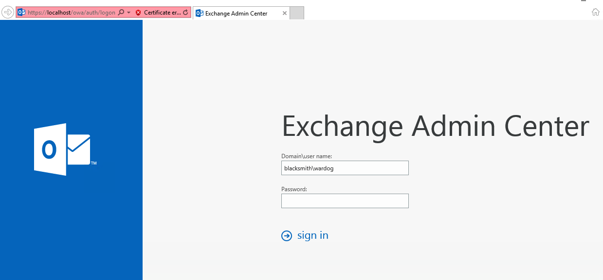
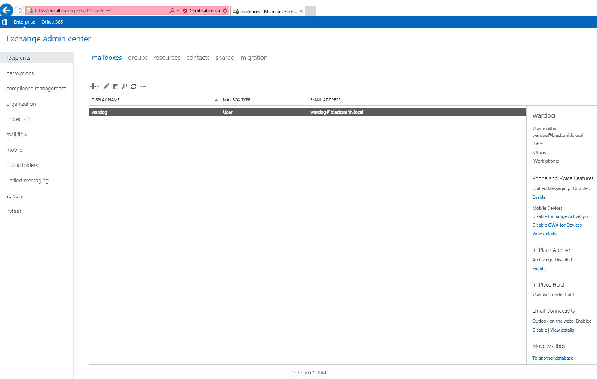
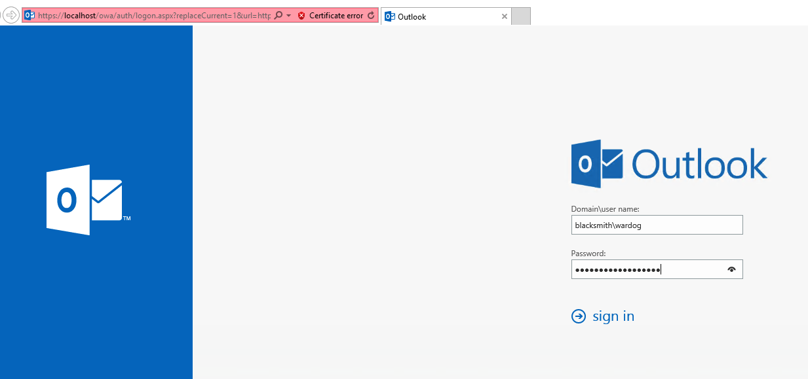
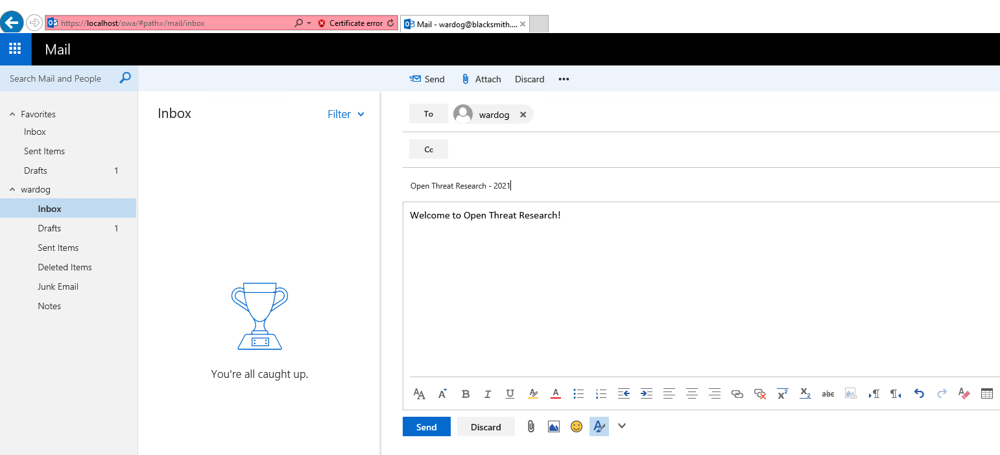
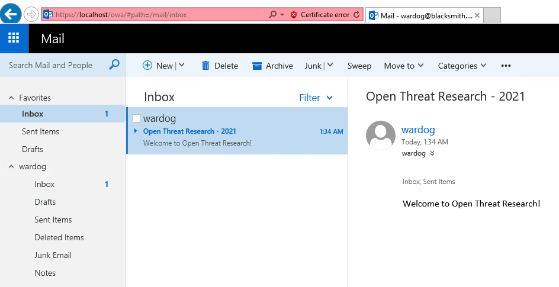

# Windows 10 + Windows Server (Active Directory) + Windows Server (MS Exchange 2016 or 2019)

 

## Resources
* One Windows Active Directory domain (One Domain Controller)
* One Windows Microsoft Exchange Server 2016 (One Server)
    * Admin mailbox audit logging enabled
    * Admin audit logging enabled (Every cmdlet and every parameter in the organization and Log Level set to `Verbose`)
* Microsoft Exchange 2019 Versions ([Exchange Server build numbers and release dates](https://learn.microsoft.com/en-us/Exchange/new-features/build-numbers-and-release-dates)):
    * `MXS2019-x64-CU12-KB5011156` -> `ExchangeServer2019-x64-CU12.ISO`
    * `MXS2019-x64-CU11-KB5005334` -> `ExchangeServer2019-x64-CU11.ISO`
* Microsoft Exchange 2016 Versions ([Exchange Server build numbers and release dates](https://learn.microsoft.com/en-us/Exchange/new-features/build-numbers-and-release-dates)):
    * `MXS2016-x64-CU23-KB5011155` -> `ExchangeServer2016-x64-CU23.ISO`
    * `MXS2016-x64-CU22-KB5005333` -> `ExchangeServer2016-x64-CU22.ISO`
    * `MXS2016-x64-CU21-KB5003611` -> `ExchangeServer2016-x64-CU21.ISO`
    * `MXS2016-x64-CU20-KB4602569` -> `ExchangeServer2016-x64-CU20.ISO`
    * `MXS2016-x64-CU19-KB4588884` -> `ExchangeServer2016-x64-CU19.ISO`
    * `MXS2016-x64-CU18-KB4571788` -> `ExchangeServer2016-x64-cu18.iso`
    * `MXS2016-x64-CU17-KB4556414` -> `ExchangeServer2016-x64-cu17.iso`
    * `MXS2016-x64-CU16-KB4537678` -> `ExchangeServer2016-x64-CU16.ISO`
    * `MXS2016-x64-CU15-KB4522150` -> `ExchangeServer2016-x64-CU15.ISO`
    * `MXS2016-x64-CU14-KB4514140` -> `ExchangeServer2016-x64-cu14.iso`
    * `MXS2016-x64-CU13-KB4488406` -> `ExchangeServer2016-x64-cu13.iso`
* Windows 10 Workstations (Max. 10)
* [OPTIONAL] Windows [Microsoft Monitoring Agent](https://docs.microsoft.com/en-us/services-hub/health/mma-setup) installed
    * It connects to the Log Analytics workspace defined in the template.
* [OPTIONAL] Sysmon
    * [Sysmon Config](https://github.com/OTRF/Blacksmith/blob/master/resources/configs/sysmon/sysmon.xml)

## Access Exchange Admin Center

* RDP to MXS01 Server with admin credentials
* Browse to `https://localhost/ecp/?ExchClientVer=15`. When prompted with an error page for the website's security certificate, click Continue to this website.

## Test Local E-mail Delivery

* RDP to MXS01 Server with admin credentials
* Browse to `https://localhost/owa`. When prompted with an error page for the website's security certificate, click Continue to this website.
* On the Outlook sign-in page, use the `blacksmith\<admin>` account name with its password (You defined that in the ARM template)

* When prompted to specify the language and time zone, select the appropriate value for each, and then click Save.
* Click on Inbox > New. In To, type `<admin name>` and then click Search Directory. For Subject and messagee, type anything. Then, click Send.

* Wait for 2 minutes and refresh your inbox messages. You should see a new message as shown in the image below:

